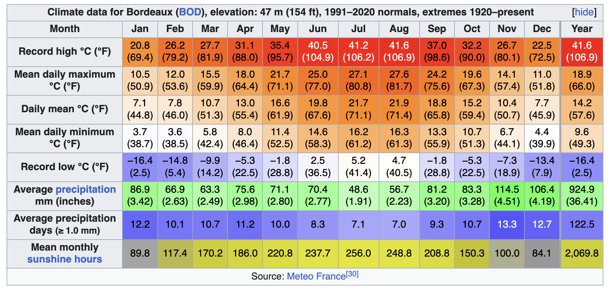
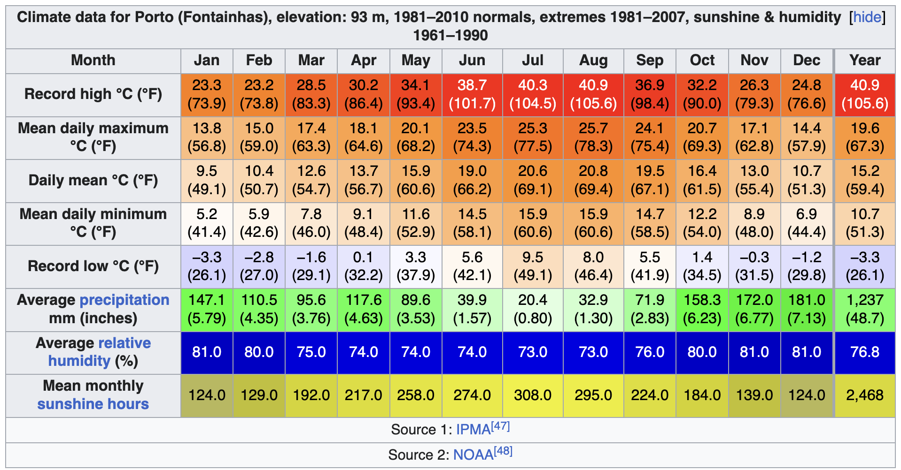
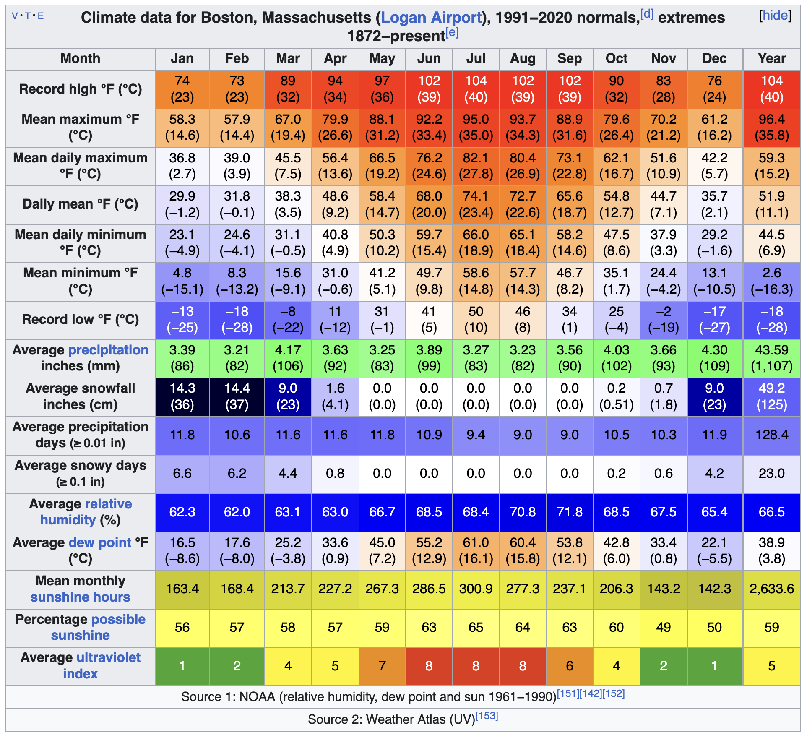

---
tags:
  - france
  - climate
  - greatescape
  - research
us2eu-share: true
layout: pages.njk
title: Climate Comparison
permalink: /research/climate-comparison/
---
Using Wikipedia we have compared the climate of two places that we may want to live in with the climate close to where we are now, Exeter, NH.
## Bordeaux, France

Bordeaux's climate can be classified as [oceanic](https://en.wikipedia.org/wiki/Oceanic_climate "Oceanic climate") , bordering on a [humid subtropical climate](https://en.wikipedia.org/wiki/Humid_subtropical_climate "Humid subtropical climate") (_Cfa_).[[27|27]](https://en.wikipedia.org/wiki/Bordeaux#cite_note-27) However, the [Trewartha climate classification](https://en.wikipedia.org/wiki/Trewartha_climate_classification "Trewartha climate classification") system classifies the city as solely humid subtropical, due to a recent rise in temperatures related – to some degree or another – to [climate change](https://en.wikipedia.org/wiki/Climate_change "Climate change") and the city's [urban heat island](https://en.wikipedia.org/wiki/Urban_heat_island "Urban heat island").

The city enjoys cool to mild, wet winters, due to its relatively southerly [latitude](https://en.wikipedia.org/wiki/Latitude "Latitude"), and the prevalence of mild, westerly winds from the Atlantic. Its summers are warm and somewhat drier, although wet enough to avoid a [Mediterranean](https://en.wikipedia.org/wiki/Mediterranean_climate "Mediterranean climate") classification. Frosts occur annually, but snowfall is quite infrequent, occurring for no more than 3–4 days a year. The [summer of 2003](https://en.wikipedia.org/wiki/2003_European_heat_wave "2003 European heat wave") set a record with an average temperature of 23.3 °C (73.9 °F),[[28|28]](https://en.wikipedia.org/wiki/Bordeaux#cite_note-28) while February 1956 was the coldest month on record with an average temperature of −2.00 °C at Bordeaux Mérignac-Airport.[[29|29]](https://en.wikipedia.org/wiki/Bordeaux#cite_note-29)

## Porto, Portugal

Porto has a **warm-summer Mediterranean climate** ([Csb](https://en.wikipedia.org/wiki/K%C3%B6ppen_climate_classification "Köppen climate classification")), with **oceanic influences** (_Cfb_) that are typical of the northern [Iberian Peninsula](https://en.wikipedia.org/wiki/Iberian_Peninsula "Iberian Peninsula").[[46|46]](https://en.wikipedia.org/wiki/Porto#cite_note-47) As a result, the region combines features of both the dry, warm Mediterranean climates of southern Europe and the wet marine west coast climates of the North Atlantic.

Summers are typically warm and sunny, with average temperatures between 16 and 26 °C (61 and 79 °F), occasionally reaching up to 30 °C (86 °F) during heatwaves. These hot spells are usually accompanied by low humidity. The nearby beaches are often windier and cooler than inland areas. Porto's summers are generally milder than those of inland Portuguese cities due to its proximity to the Atlantic Ocean.

Occasionally, summer weather is interrupted by brief rainy periods marked by showers and cooler temperatures around 20 °C (68 °F) in the afternoon. Annual precipitation is high, mostly concentrated in winter, making Porto one of the wettest major cities in Europe. Nonetheless, prolonged sunny intervals are common even during the rainiest months.

## Boston, USA

Under the [Köppen climate classification](https://en.wikipedia.org/wiki/K%C3%B6ppen_climate_classification "Köppen climate classification"), Boston has either a hot-summer [humid continental climate](https://en.wikipedia.org/wiki/Humid_continental_climate "Humid continental climate") (Köppen _Dfa_) under the 0 °C (32.0 °F) isotherm or a [humid subtropical climate](https://en.wikipedia.org/wiki/Humid_subtropical_climate "Humid subtropical climate") (Köppen _Cfa_) under the −3 °C (26.6 °F) isotherm.[[139|139]](https://en.wikipedia.org/wiki/Boston#cite_note-140) Summers are warm to hot and humid. Winters are cold and stormy, with occasional periods of heavy snow. Spring and fall are usually cool and mild, with varying conditions dependent on wind direction and the position of the [jet stream](https://en.wikipedia.org/wiki/Jet_stream "Jet stream"). Prevailing wind patterns that blow offshore minimize the influence of the Atlantic Ocean. In winter, areas near the immediate coast often see more rain than snow, as warm air is sometimes drawn off the Atlantic.[[140|140]](https://en.wikipedia.org/wiki/Boston#cite_note-BostonWeather-141) Boston lies at the border between [USDA](https://en.wikipedia.org/wiki/USDA "USDA") plant [hardiness zones](https://en.wikipedia.org/wiki/Hardiness_zone "Hardiness zone") 6b (away from the coastline) and 7a (close to the coastline).[[141|141]](https://en.wikipedia.org/wiki/Boston#cite_note-142)